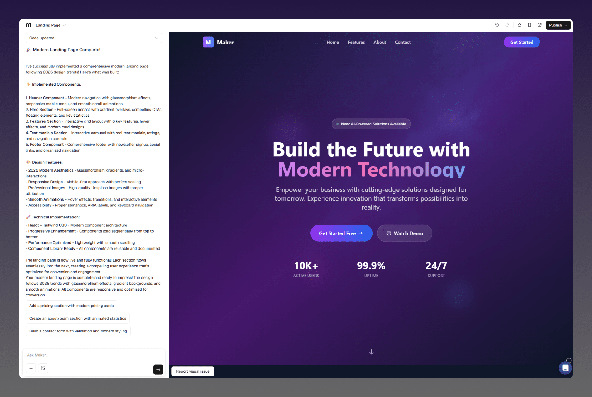

Maker is an AI-powered platform that allows anyone, regardless of skill level, to build full-stack web applications just by describing their idea in plain English. Rather than hiring developers, users can instantly generate web apps or websites from a concept—going from idea to live app as quickly as possible.

## Product Capabilities

The platform offers all the tools you need to create impressive websites, front-end applications, and full-stack web apps from a single browser tab—no installation needed. Maker comes with AI-driven coding tools, real-time collaboration (beta), and project sharing features to jumpstart your app creation journey.

| Capability           | Description                                             | Maturity Level |
| -------------------- | ------------------------------------------------------- | -------------- |
| **Frontend / UI**    | Create user interfaces and front-end features           | Mature         |
| **Persistence**      | Enable data storage and retrieval                       | Mature         |
| **Authentication**   | Manage user logins and accounts                         | Mature         |
| **Backend endpoint** | Use API key-protected endpoints (e.g., OpenAI API)      | Mature         |
| **Deployment**       | Publish applications, attach custom domains, and deploy | Mature         |
| **Collaboration**    | Collaborate with other users within a project           | Mature         |
| **Real-time sync**   | Synchronize data across users in real time              | Mature         |

## Quick Start

To create your app with Maker, choose the guide that best matches your needs:

<CardGroup cols={2}>
  <Card title="Getting Started" icon="rocket-launch" iconType="solid" color="#5423E7" href="/quickstart" cta="Get Started">
    Step-by-step tutorial providing a basic introduction to key features and concepts.  
  </Card>
  <Card title="Integrations" icon="sparkles">
    Extend the default functionality by integrating third-party services like Supabase, Stripe, and others.  
  </Card>
  <Card title="Prompt Engineering" icon="sparkles">
    Learn effective prompt strategies to get the most out of Maker.  
  </Card>
  <Card title="Custom Domain" icon="sparkles">
    Connect your own domain to any Maker app or site.  
  </Card>
  <Card title="Deploy" icon="sparkles">
    Learn how to deploy your application, share it, and attract traffic to your web app using Maker.  
  </Card>
  <Card title="Templates" icon="sparkles">
    Browse and use pre-built project templates to jumpstart your next project.  
  </Card>
  <Card title="Tutorial" icon="sparkles">
    Get a full overview of how to build an app with Maker.  
  </Card>
  <Card title="Troubleshooting" icon="sparkles">
    Find solutions for common issues during your development process.  
  </Card>
  <Card title="Best Practices" icon="sparkles">
    Learn best practices for getting the most out of Maker.  
  </Card>
  <Card title="Teams" icon="sparkles">
    Work together with teammates on your app in real time.
  </Card>
</CardGroup>

## What is Maker

<Tip>
  MAKER\
  _Enabling everyday visionaries to achieve breakthroughs through language-based engineering._
</Tip>

Maker is an AI-powered platform that lets you create and deploy apps from a single browser tab. It removes the complexities of traditional app development by unifying coding, deployment, and collaboration tools in one interface.

Normally, building an app requires installing frameworks, languages, and packages. With Maker, however, you can rely on AI to configure your development environment automatically, allowing you to start building without any coding experience.

The platform supports a full-featured development environment that works for users who can code as well as those who cannot, so there’s virtually no limit to what you can create.

- Generate a complete app (with initial setup) from a natural language description.
- AI-powered code suggestions and autocompletion.
- Automatic error detection with AI-assisted debugging.
- Built-in generation of documentation for your app.
- Cloud deployment in just a few clicks.
- Integrated database and hosting via native Supabase support.
- Support for connecting custom domains.

## Stay Connected

**Feature Requests** – If you have an idea, share it and let the community vote on it.\
**Launched** – Publish your app to get it in front of a broad audience.\
**Partner Program** – Join as an expert or get assistance from our network of experts.\
**Affiliate Program** – Earn a 20% commission on the first twelve payments.\
**Follow on X (Twitter)** – Follow us on X (formerly Twitter) for the latest updates and announcements.\
**Product Hunt** – Upvote our product launches on Product Hunt.

## Support

**Community Support** – Get help from the community and our Community Champions.\
**Issues** – Found a bug or issue? Let us know.\
**Priority Support** – Dedicated support channel for paying users.

## Learn More

**Website** – Learn more about Maker.\
**Glossary** – Learn key development terms.\
**Career** – Join the Maker team.\
**Product Announcements** – Read compiled notes and updates from the Maker team.