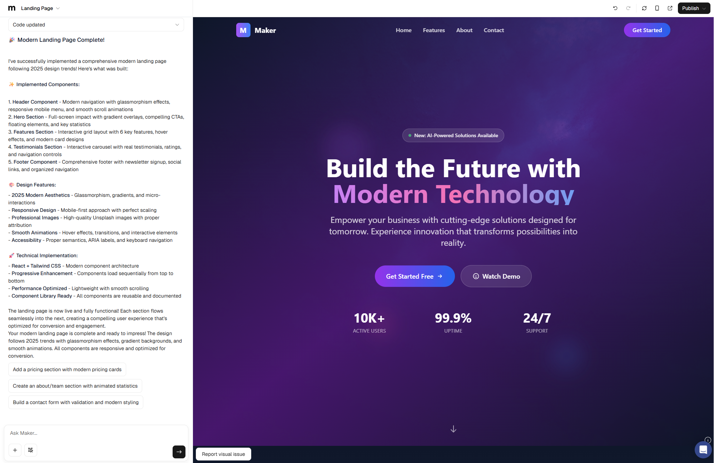

Lovable is an AI-powered platform that enables users of any skill level to create full-stack web applications without requiring coding expertise by simply describing what they want in plain English. Instead of hiring developers, users can generate web apps or websites instantly. - taking you **from idea to app** as fast as possible.

## Product Capabilities

The platform provides all the tools you need to create amazing websites, front-end applications as well as full-stack web applications from one browser tab - in installation required. Lovable includes AI coding tools, real-time collaboration (beta test), and project sharing to give you a head start on your app creation journey.

## Setting up

The first step to world-class documentation is setting up your editing environments.

<CardGroup cols={2}>
  <Card title="Edit Your Docs" icon="pen-to-square" href="https://mintlify.com/docs/quickstart">
    Get your docs set up locally for easy development
  </Card>
  <Card title="Preview Changes" icon="image" href="https://mintlify.com/docs/development">
    Preview your changes before you push to make sure they're perfect
  </Card>
</CardGroup>

## Make it yours

Update your docs to your brand and add valuable content for the best user conversion.

<CardGroup cols={2}>
  <Card title="Customize Style" icon="palette" href="https://mintlify.com/docs/settings/global">
    Customize your docs to your company's colors and brands
  </Card>
  <Card title="Reference APIs" icon="code" href="https://mintlify.com/docs/api-playground/openapi">
    Automatically generate endpoints from an OpenAPI spec
  </Card>
  <Card title="Add Components" icon="screwdriver-wrench" href="https://mintlify.com/docs/content/components/accordions">
    Build interactive features and designs to guide your users
  </Card>
  <Card title="Get Inspiration" icon="stars" href="https://mintlify.com/customers">
    Check out our showcase of our favorite documentation
  </Card>
</CardGroup>